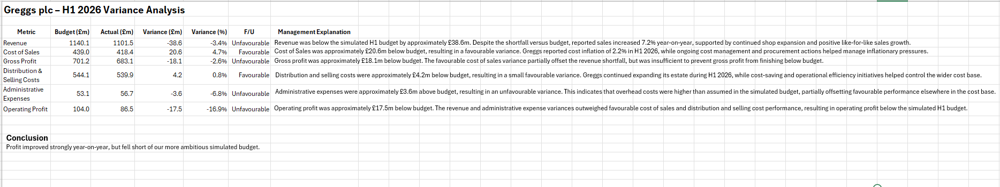
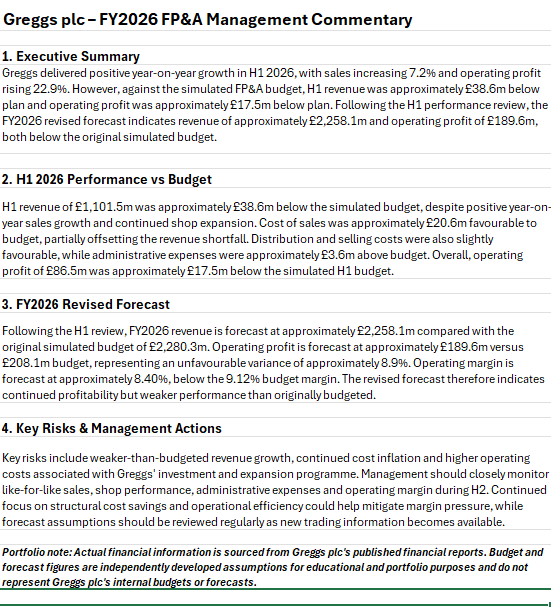

# Greggs plc – FP&A Budget, Variance & Forecast Analysis

## Project Overview

This project demonstrates an FP&A-style budgeting, variance analysis and forecasting process using Greggs plc as a real-company case study.

Published FY2025 and H1 2026 financial results were used as the actual financial data. I then independently developed a simulated FY2026 budget and H2 forecast assumptions to analyse performance, identify key variances and produce a revised full-year forecast.

The project demonstrates practical Excel, financial analysis, budgeting, forecasting, variance analysis and management reporting skills.

> **Disclaimer:** Actual financial information is sourced from Greggs plc's published financial reports. Budget and forecast figures are independently developed assumptions for educational and portfolio purposes and do not represent Greggs plc's internal budgets or forecasts.

---

## Dashboard

---

## Project Objectives

The analysis was designed to:

- Build a simulated FY2026 operating budget.
- Compare H1 2026 actual performance against budget.
- Identify favourable and unfavourable financial variances.
- Analyse key revenue, cost and profitability drivers.
- Develop an updated FY2026 forecast using H1 actual performance.
- Present the results through an FP&A management dashboard and management commentary.

---

## Tools & Skills

- Microsoft Excel
- Budgeting & Forecasting
- Variance Analysis
- Financial Modelling
- Financial Statement Analysis
- Management Reporting
- Dashboard Development

---

## Data Sources

Actual financial information was sourced from:

- Greggs plc Annual Report and Accounts 2025
- Greggs plc Interim Results for the 26 weeks ended 27 June 2026

The published information was used for actual financial results and selected operating KPIs.

Budget and forecast assumptions were independently developed for this portfolio project.

---

## Workbook Structure

| Worksheet | Purpose |
|---|---|
| 01_Source_Data | Published FY2025 and H1 2026 financial data and operating KPIs |
| 02_Budget | Simulated FY2026 operating budget |
| 03_Actual_vs_Budget | H1 2026 actual performance compared with simulated budget |
| 04_Variance_Analysis | Favourable/unfavourable variance analysis and management explanations |
| 05_Forecast | Revised FY2026 forecast based on H1 actuals and H2 assumptions |
| 06_Dashboard | Management-level summary of performance |
| 07_Management_Commentary | Executive summary, outlook, risks and management actions |

---

## Budget Methodology

FY2025 reported results were used as the starting point for the simulated FY2026 budget.

Key assumptions:

| Assumption | FY2026 Budget |
|---|---:|
| Revenue Growth | 6.0% |
| Cost of Sales | 38.5% of Revenue |
| Distribution & Selling Cost Growth | 5.0% |
| Administrative Expense Growth | 4.0% |

For the H1 actual-versus-budget analysis, 50% of the simulated FY2026 budget was used as a simplified H1 phasing assumption.

This approach is used for portfolio analysis and does not represent Greggs plc's internal budgeting methodology.

---

## H1 2026 Performance vs Budget

Greggs reported H1 2026 revenue of **£1,101.5m** and operating profit of **£86.5m**.

Against the simulated H1 budget:

| Metric | Variance |
|---|---:|
| Revenue | approximately £38.6m unfavourable |
| Cost of Sales | approximately £20.6m favourable |
| Gross Profit | approximately £18.1m unfavourable |
| Distribution & Selling Costs | approximately £4.2m favourable |
| Administrative Expenses | approximately £3.6m unfavourable |
| Operating Profit | approximately £17.5m unfavourable |

Although performance was below the simulated budget, Greggs reported year-on-year sales growth of **7.2%** and operating profit growth of **22.9%** during H1 2026.

---

## Variance Analysis

---

## Revised FY2026 Forecast

Following the H1 review, I developed an updated H2 forecast using the following assumptions:

| Forecast Assumption | H2 2026 |
|---|---:|
| Revenue Growth vs H1 | 5.0% |
| Cost of Sales | 38.0% of Revenue |
| Distribution & Selling Cost Growth vs H1 | 3.0% |
| Administrative Expense Growth vs H1 | 2.0% |

The revised full-year forecast produced:

| Metric | FY2026 Budget | Revised Forecast | Variance |
|---|---:|---:|---:|
| Revenue | £2,280.3m | £2,258.1m | -1.0% |
| Gross Profit | £1,402.4m | £1,400.2m | -0.2% |
| Operating Profit | £208.1m | £189.6m | -8.9% |
| Operating Margin | 9.12% | 8.40% | -0.73pp |

The forecast indicates that the revenue shortfall and higher operating expenses create greater pressure on operating profit and margin than on overall sales.

---

## Management Commentary

The management commentary summarises performance, forecast implications, key risks and potential management actions.

---

## Key Management Insights

**Revenue performance:** Monitor like-for-like sales and new-shop performance to assess whether the revenue gap can be reduced during H2.

**Cost control:** Maintain focus on cost efficiencies and structural savings to protect profitability.

**Overhead management:** Monitor administrative expenditure and investigate areas running above the simulated budget.

**Forecast monitoring:** Update forecast assumptions as new trading information becomes available and assess the impact on operating profit and margin.

---

## Key Takeaway

This project demonstrates how publicly available financial information can be transformed into an FP&A-style management model by combining budgeting, actual-versus-budget analysis, forecasting, dashboard reporting and management commentary.

Under the assumptions used in the model, Greggs remains profitable but the revised forecast highlights pressure on operating profit and operating margin relative to the original simulated budget.

---

## Download the Model

The complete Excel workbook is available in this repository:

**Greggs FPA Budget Forecast Analysis.xlsx**

---

## Disclaimer

This project was created independently for educational and portfolio purposes.

Greggs plc has not provided, reviewed or endorsed the simulated budget, forecast or management analysis contained in this project.

All company-reported financial data is derived from publicly available Greggs plc financial publications.
